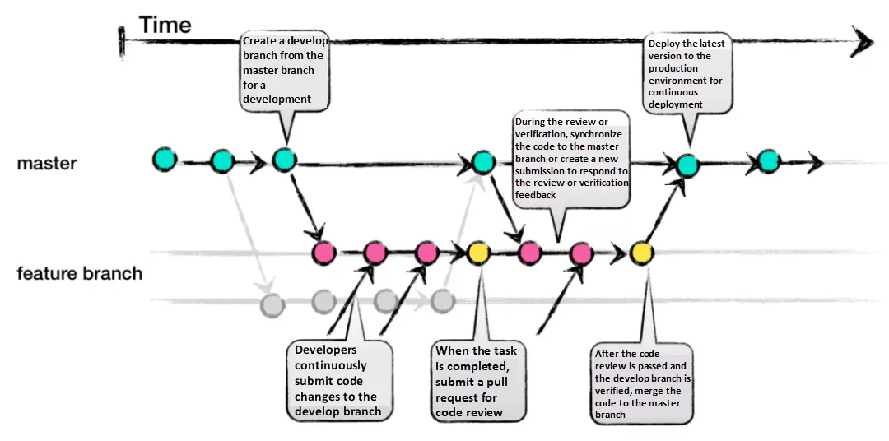

# [Choosing the Right Git Branching Strategy: A Comparative Analysis](https://medium.com/@sreekanth.thummala/choosing-the-right-git-branching-strategy-a-comparative-analysis-f5e635443423)

## GitHub-Flow

### Pros:
- Faster feedback cycles and shorter production cycles.
- Ideal for asynchronous work in smaller teams.
- Agile and easier to comprehend compared to Git-Flow.

### Cons:
- Merging a feature branch implies it is production-ready, potentially introducing bugs without proper testing and a robust CI/CD process.
- Long-living branches can complicate the process.
- Challenging to scale for larger teams due to increased merge conflicts.
- Supporting multiple release versions concurrently is difficult. 


## 

```
[main]

git checkout -b [develop branch]  # DEVELOP-0


git checkout -b [feature-branch]  # 0.0-header-0


```


